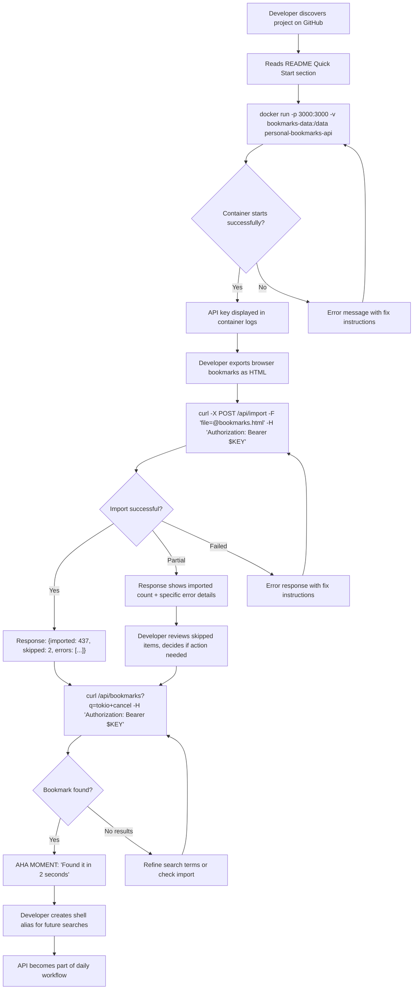
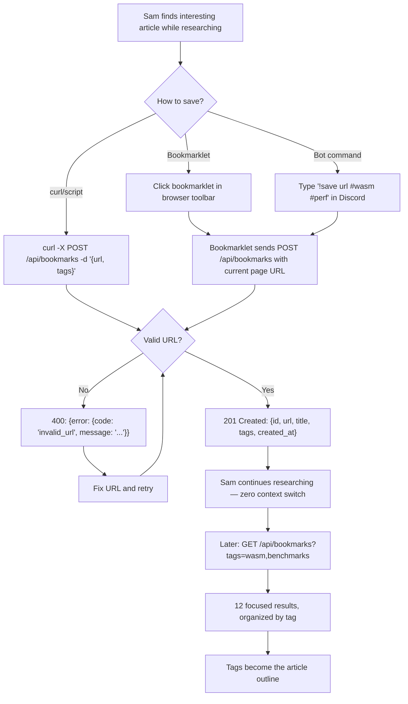
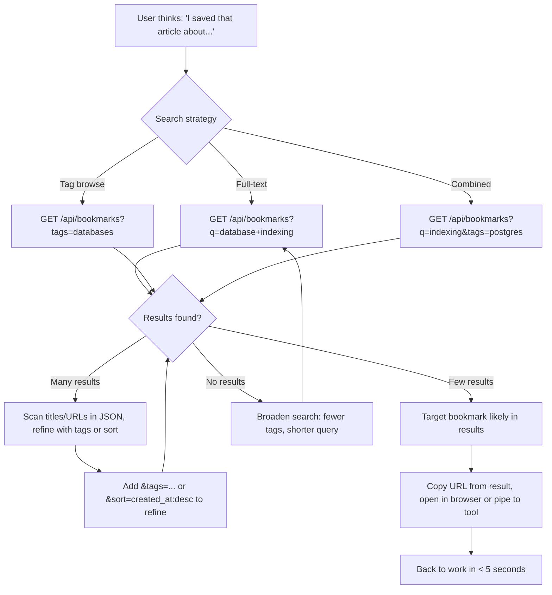
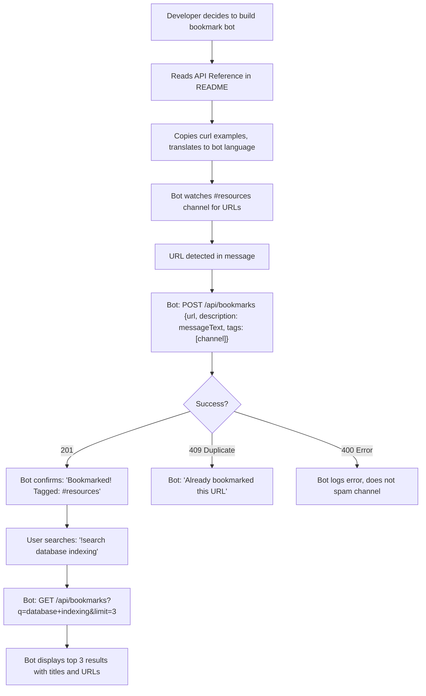

# UX Design Specification personal-bookmarks-api

**Author:** User
**Date:** 2026-03-20

---

<!-- UX design content will be appended sequentially through collaborative workflow steps -->

## Executive Summary

### Project Vision

personal-bookmarks-api reimagines bookmark management by stripping away the UI assumption entirely. Instead of another web app with an API bolted on, this product IS the API — a clean, minimal REST service that treats bookmarks as structured, queryable data. The UX vision centers on developer ergonomics: every interaction should feel as natural as running a shell command or writing a fetch call. The "interface" is whatever the developer builds on top — a terminal alias, a browser bookmarklet, a Raycast extension, a Next.js dashboard. The product succeeds when the API disappears into the developer's existing workflow so seamlessly that they forget it's there.

### Target Users

**Primary: Dev Alex — The Automation-Minded Developer**
A developer who lives in the terminal, manages a personal VPS, and writes shell scripts for daily tasks. Alex has 500+ bookmarks scattered across Chrome, Firefox, and Safari with no single source of truth. The "aha moment" is running `bm "rust async"` from any terminal and finding a link they'd lost in the browser bookmark graveyard. Alex values: zero-friction CLI integration, predictable JSON responses, fast search, and the confidence that every link is in one queryable place.

**Primary: Researcher Sam — The Knowledge Curator**
A technical writer who saves 10-15 links per day during research sprints. Sam's problem isn't finding links — it's the friction of *saving* them. Switching to Notion or Raindrop breaks flow. Sam needs one-click save (bookmarklet/extension hitting the API) with quick tagging, and later retrieves links by tag taxonomy. For Sam, the tagging system IS the outline for their writing.

**Secondary: API Consumers (Bots, Scripts, Integrations)**
Automated systems that programmatically create and query bookmarks — Discord bots archiving shared links, cron jobs importing browser exports, personal dashboards displaying recent saves. These consumers validate the API-first design: if a bot can use the API without an SDK, the developer ergonomics are right.

### Key Design Challenges

1. **The "Invisible UI" Problem:** With no mandatory web interface, the UX IS the API contract — endpoint naming, response shapes, error messages, query parameter design, and documentation. Every design decision that would normally be a button or layout choice becomes an API design choice. A confusing error response is the equivalent of a broken form field.

2. **Onboarding Without a Screen:** The 5-minute onboarding target (docker run → first API call) must be achievable through documentation alone. There's no guided setup wizard — the README, error messages, and API responses must teach the user how to use the product. The first `curl` command needs to "just work."

3. **Multi-Surface Experience Consistency:** Users will interact through diverse surfaces — terminal (curl/httpie), scripts (Python/Node), bookmarklets (browser), dashboards (web), and bots (Discord/Slack). The API must return data structures that work naturally across all these contexts without transformation gymnastics.

### Design Opportunities

1. **Exemplary API Ergonomics as UX:** The opportunity is to make this the gold standard of how a personal API should feel. Predictable URL patterns, self-documenting error responses (the error message tells you exactly how to fix your request), sensible defaults that make the common case trivial (e.g., `GET /api/bookmarks` returns the most useful view without any parameters).

2. **Documentation as Interface:** Since the README and API docs ARE the onboarding experience, investing in exceptional documentation — with copy-pasteable curl examples for every endpoint, progressive complexity (simple → advanced), and a "recipes" section showing real integration patterns — creates an onboarding experience that rivals any GUI wizard.

3. **Import as the Gateway Drug:** The Netscape HTML import is the single most important UX moment. It transforms the API from "an empty tool I'd have to populate" to "a fully loaded search engine for MY bookmarks" in one command. Designing this to be frictionless (accept any browser export, auto-map folders to tags, report clear success/failure) is the highest-leverage UX investment.

## Core User Experience

### Defining Experience

The core user action for personal-bookmarks-api is **search and retrieval** — the moment a developer types a query and gets back the exact bookmark they were looking for. Everything flows from this: bookmarks are only valuable if you can find them again. The secondary core action is **frictionless capture** — saving a bookmark must be so fast that it never breaks the user's current workflow context.

The core loop is: **Capture → Organize (tag) → Retrieve → Integrate**. Each cycle strengthens the system's value — more bookmarks with better tags means better search results, which builds trust, which encourages more saving. The flywheel only works if every step in the loop is nearly effortless.

For an API product, the "interface" is the request-response contract. A well-designed endpoint is the equivalent of an intuitive button placement. The core experience IS:
- **Predictable URLs** you can guess without reading docs (`/api/bookmarks?q=rust` just works)
- **Minimal required fields** — only URL is truly required; the API should do sensible things with defaults
- **JSON responses shaped for piping** — flat enough for `jq`, structured enough for dashboards

### Platform Strategy

**Primary Platform: HTTP/REST (Any Client)**
The API is platform-agnostic by design. The "platform" is any tool that speaks HTTP — curl, httpie, Python requests, JavaScript fetch, Go net/http. This is the product's superpower: it runs everywhere without platform-specific builds.

**Deployment Platform: Docker + SQLite**
Single container, single data file, mountable volume. The platform strategy is "runs on anything with Docker" — personal VPS, Raspberry Pi, NAS, cloud VM. Zero external dependencies.

**Consumer Surfaces (Built on Top):**
- Terminal (curl, shell aliases, CLI tools) — primary for Dev Alex
- Browser (bookmarklets, extensions) — primary for Researcher Sam
- Web dashboards (React, Next.js) — power user visualization
- Bots (Discord, Slack) — team/automated use
- The API must serve all surfaces equally without favoring any one client type

**Offline Consideration:** Not applicable — the API is a server-side service. Offline behavior is the responsibility of client applications built on top.

### Effortless Interactions

1. **Search should feel like autocomplete.** `GET /api/bookmarks?q=rust async` returns relevant results in < 200ms. No special query syntax to learn, no boolean operators required (though they could be supported). Just type what you remember — a word from the title, a fragment of the URL, a tag name — and the bookmark surfaces.

2. **Saving a bookmark should be one command.** `curl -X POST .../api/bookmarks -d '{"url":"..."}' -H "Authorization: Bearer $KEY"` — that's it. Title can be omitted (auto-extract later or leave blank). Tags are optional. The barrier to saving must be near-zero.

3. **Import should be drag-and-drop simple.** Export bookmarks from any browser, `curl -F "file=@bookmarks.html" .../api/import`, done. Folder hierarchy automatically maps to tags. The user's entire bookmark history becomes searchable in one command.

4. **Authentication should be invisible after setup.** Set `$KEY` in your environment once. Every subsequent command just works. No token refresh, no OAuth dance, no session management.

5. **Error recovery should be self-documenting.** A `400` response doesn't just say "bad request" — it says exactly which field is wrong and what format it expects. The error message IS the documentation.

### Critical Success Moments

1. **The First Search Hit** — The moment after import when a user searches for a bookmark they couldn't find in their browser and the API returns it instantly. This is the "I'm never going back" moment. If this fails — if search returns irrelevant results or misses the target — the product loses the user.

2. **The Import Moment** — Going from zero to hundreds of searchable bookmarks in one command. If import fails, chokes on a format quirk, or silently drops bookmarks, the user never reaches the search moment. Import reliability IS the onboarding funnel.

3. **The First Integration** — When a user writes their first shell alias, bookmarklet, or bot command that hits the API. This transforms the product from "a thing I tried" to "part of my workflow." The API response structure must make this integration trivial — no data transformation, no pagination gymnastics, just pipe and go.

4. **The Container Restart** — When the VPS reboots and everything is still there. Data persistence is invisible when it works and catastrophic when it doesn't. This moment must be boring — zero surprises, zero data loss.

### Experience Principles

1. **Predictability Over Cleverness** — Every endpoint, parameter, and response should behave exactly as a developer would guess. No magic, no surprises, no "smart" defaults that confuse. If a developer can predict the API's behavior without reading docs, we've succeeded.

2. **Zero-Friction Capture** — The cost of saving a bookmark must be lower than the cost of thinking "I'll save it later." One command, one click, one API call. Every additional required field or validation step is friction that kills adoption.

3. **Search as the Core Promise** — The API's value proposition lives or dies by search quality. Full-text search must be fast, relevant, and forgiving. A user who can't find their bookmarks has a fancy URL database, not a productivity tool.

4. **Self-Documenting Responses** — Every API response should teach the user something. Error messages explain how to fix the request. Success responses include enough context to know what happened without reading docs. The API is its own documentation.

5. **Composability Over Completeness** — Don't build features that belong in client applications. Build primitives that compose beautifully. A clean `GET` with good filtering is worth more than a built-in dashboard.

## Desired Emotional Response

### Primary Emotional Goals

**Empowered and In Control** — The dominant feeling should be mastery. When a developer queries their bookmarks from the terminal, they should feel like they've unlocked a superpower — their messy, scattered bookmark collection is now a crisp, queryable database at their fingertips. The API doesn't do things *for* the user; it gives the user tools to do things *themselves*, exactly the way they want.

**Confident and Trusting** — Users must trust that their data is safe, their bookmarks are all there, and the API will behave predictably. Confidence comes from consistency — every endpoint works the same way, every error response has the same shape, every restart preserves data. No surprises, no anxiety.

**Efficient and Unencumbered** — The feeling of velocity. No sign-up friction, no configuration ceremony, no waiting. Docker run → API key → first bookmark. The product should feel like removing a bottleneck, not adding a tool.

### Emotional Journey Mapping

| Stage | Desired Emotion | What Triggers It |
|---|---|---|
| **Discovery** (finding the project) | Curiosity + Recognition | "This is exactly what I've been looking for" — README clearly describes their pain |
| **Onboarding** (docker run → first call) | Surprised Ease | "That was... it? It's already running?" — sub-5-minute setup |
| **Import** (loading existing bookmarks) | Excited Relief | "All 500 bookmarks, searchable, one command" — instant value from existing data |
| **First Search** | Triumphant Satisfaction | "Found it in 2 seconds" — the bookmark that was lost in the browser graveyard |
| **First Integration** | Creative Empowerment | "I just built a shell alias / bookmarklet / bot in 10 minutes" — the API as building block |
| **Daily Use** | Quiet Confidence | "I know exactly where that link is" — the anxiety of lost bookmarks is gone |
| **Error Encounter** | Guided, Not Frustrated | "Oh, I see — the error message told me exactly what to fix" — errors that teach |
| **Container Restart** | Boring Reliability | "Everything's still here" — data persistence that's invisible |

### Micro-Emotions

**Confidence over Confusion** — The API should never make a developer feel stupid. Every interaction should reinforce "I know how this works." Predictable endpoints, consistent response shapes, and sensible defaults build confidence with every request.

**Trust over Skepticism** — Especially critical for data persistence. Import reports exactly how many bookmarks were saved. Health checks confirm data integrity. Export lets you verify everything is there. The API earns trust through transparency.

**Accomplishment over Frustration** — The gap between "I want to do X" and "I did X" should be tiny. No multi-step ceremonies. No mysterious failures. The shortest path from intention to result.

**Calm Focus over Cognitive Load** — The API should reduce mental overhead, not add it. No complex auth flows to remember, no pagination tokens to manage, no state to track. Fire a request, get a result, move on.

### Design Implications

- **Empowered → API Design:** Expose powerful query parameters (combine search + tag filter + sort in one call). Don't restrict what users can do — give them composable primitives.
- **Confident → Consistent Contracts:** Every list endpoint uses the same pagination pattern. Every error response has the same `{error: {code, message}}` shape. Every timestamp is ISO 8601. Consistency breeds confidence.
- **Efficient → Sensible Defaults:** `GET /api/bookmarks` without parameters returns the 20 most recent bookmarks. No required query parameters. The most common use case should be the simplest request.
- **Trusting → Transparent Operations:** Import response includes `{imported: 437, skipped: 2, errors: [{line: 145, reason: "invalid URL"}]}`. Never silently drop data. Always report what happened.
- **Calm → Minimal Cognitive Load:** One auth mechanism (Bearer token). One data format (JSON). One import format (Netscape HTML). No choices to agonize over.

### Emotional Design Principles

1. **Delight Through Simplicity** — The most delightful moment isn't a clever animation or Easter egg — it's when the API call works on the first try, exactly as the developer expected. Simplicity IS the delight.

2. **Trust Through Transparency** — Every operation reports its outcome clearly. Import tells you exactly what happened. Errors tell you exactly what went wrong. The API never leaves the user guessing.

3. **Empowerment Through Composability** — The emotional payoff of this product isn't in any single feature — it's in the moment a developer realizes they can build *anything* on top of it. The API is Lego bricks, not a finished model.

4. **Calm Through Reliability** — The highest emotional compliment for an infrastructure tool is that the user *forgets it's there*. It just works, every time, after every restart, with every query. Boring is beautiful.

## UX Pattern Analysis & Inspiration

### Inspiring Products Analysis

**1. Stripe API — The Gold Standard of Developer Experience**
Stripe didn't just build a payment API — they built the template for how every API should feel. What they do brilliantly:
- **Predictable REST conventions:** Resources are nouns, actions are HTTP methods, responses are consistent. A developer who's used one endpoint can guess how every other endpoint works.
- **Error messages that teach:** `{"error": {"type": "card_error", "code": "incorrect_number", "message": "Your card number is incorrect.", "param": "number"}}` — the error tells you the type, the code, what went wrong in plain English, AND which parameter caused it.
- **Copy-paste documentation:** Every endpoint has a curl example you can copy, paste, change one value, and it works. The docs ARE the onboarding.
- **Sensible defaults everywhere:** Default pagination, default sorting, default response fields. The common case requires zero configuration.

**2. httpie — CLI That Doesn't Feel Like a CLI**
httpie reimagined how developers interact with HTTP APIs from the terminal:
- **Human-readable output by default:** JSON responses are syntax-highlighted and pretty-printed. Headers are separated visually. The terminal output is designed for human eyes, not just machines.
- **Implicit content types:** `http POST :3000/bookmarks url=... title=...` — no `-H "Content-Type: application/json"` ceremony. The tool infers intent from context.
- **Progressive disclosure:** Simple requests are simple commands. Complex requests (auth, custom headers, file uploads) are available but don't clutter the basic flow.

**3. GitHub API (v3 REST) — Living Documentation**
GitHub's REST API demonstrates how an API can be self-navigable:
- **Hypermedia links in responses:** Each response includes URLs to related resources. The API tells you where to go next.
- **Consistent pagination:** `Link` headers with `rel="next"`, `rel="prev"`. Every list endpoint paginates the same way.
- **Rate limit headers:** Every response includes `X-RateLimit-Remaining`. The API proactively communicates its constraints.

### Transferable UX Patterns

**API Response Patterns:**
- **Stripe-style error objects** — Adopt the `{error: {code, message}}` pattern with machine-readable codes AND human-readable messages. Every error should be both parseable by code and understandable by a developer reading terminal output.
- **Consistent envelope pattern** — List responses always return `{data: [...], total: N, limit: N, offset: N}`. Single resources return the object directly. Predictable shapes reduce integration friction.

**Documentation Patterns:**
- **Stripe-style copy-paste examples** — Every endpoint in the README gets a complete, working curl command. Change one value and it works for the user's instance. The documentation IS the quickstart.
- **Progressive complexity in docs** — Start with the simplest possible example (`GET /api/bookmarks`), then progressively add search, tags, pagination, sorting. Don't front-load complexity.

**Onboarding Patterns:**
- **httpie-style sensible inference** — When a user POSTs a bookmark with just a URL, the API should accept it gracefully (title defaults to URL or empty, tags default to empty array). Don't require fields that aren't essential.
- **Import as instant value** — Like Spotify's playlist import or 1Password's browser import — the moment existing data flows in, the product transforms from "empty tool" to "my tool." This is the critical adoption pattern.

**Operational Patterns:**
- **GitHub-style metadata headers** — Include useful metadata in response headers: `X-Total-Count` for list endpoints, request timing, API version. Developers who need it can read it; those who don't can ignore it.

### Anti-Patterns to Avoid

1. **The "Enterprise API" Trap** — Overly complex authentication (OAuth flows, JWT refresh tokens, API key + secret pairs). For a single-user personal tool, a Bearer token is the entire auth story. Don't add complexity that serves no threat model.

2. **The "Clever Response" Anti-Pattern** — APIs that return different shapes for the same endpoint depending on query parameters, or that nest data unpredictably. If `GET /api/bookmarks` returns `[...]` but `GET /api/bookmarks?q=test` returns `{results: [...], meta: {...}}`, the inconsistency will burn every integration author.

3. **The "Silent Failure" Sin** — Import endpoints that return `200 OK` but silently dropped 50 bookmarks because of format quirks. Every operation must report exactly what it did — especially bulk operations like import.

4. **The "Documentation Afterthought"** — APIs where the docs are auto-generated OpenAPI specs with no examples, no context, and no guidance. For personal-bookmarks-api, the README with curl examples IS the primary documentation surface. Auto-generated specs are supplementary.

5. **The "Pagination Surprise"** — APIs that require pagination tokens, cursor-based pagination, or different pagination for different endpoints. Use simple, consistent `offset`/`limit` everywhere. Developers should never have to read docs to paginate.

### Design Inspiration Strategy

**What to Adopt:**
- Stripe's error response format (code + message + param) — direct transfer to all validation and error responses
- Stripe's copy-paste curl documentation style — direct transfer to README
- httpie's philosophy of sensible defaults — inform API default values and optional fields
- GitHub's consistent pagination headers — adopt `X-Total-Count` header pattern

**What to Adapt:**
- Stripe's API key model (multiple keys, restricted keys) → simplify to single Bearer key for personal use
- GitHub's hypermedia links → too complex for MVP, but include self-referential `id` fields that make constructing URLs trivial
- httpie's progressive disclosure → apply to API query parameters (simple use requires zero params, power use layers on `q`, `tags`, `sort`, `limit`, `offset`)

**What to Avoid:**
- OAuth/JWT complexity — conflicts with single-user simplicity goal
- Auto-generated-only documentation — conflicts with "documentation as interface" principle
- Cursor-based pagination — unnecessary complexity for < 10K bookmarks
- Inconsistent response envelopes — conflicts with predictability principle

## Design System Foundation

### Design System Choice

**API Design System: Custom REST Convention System**

For personal-bookmarks-api, the "design system" isn't Material Design or Tailwind — it's a consistent set of API conventions that serve as the building blocks for any client built on top. This is a custom design system approach, but for API contracts rather than visual components.

The design system has three layers:
1. **API Convention Layer** — The "component library" of endpoint patterns, response shapes, and error formats
2. **Documentation Layer** — The "style guide" of how the API communicates with developers through docs and responses
3. **Future UI Foundation** — Lightweight recommendations for companion UIs (optional web dashboard, bookmarklets) if/when they're built

### Rationale for Selection

- **No mandatory UI surface exists** — This product explicitly defers web UI to post-MVP. A visual design system would be premature investment.
- **The API contract IS the design system** — For developer-facing products, consistency in response shapes, error formats, and endpoint patterns serves the same purpose as visual consistency in a UI.
- **Solo developer, API-first scope** — Choosing Material Design or Chakra UI when there's no frontend to build would be scope creep. The design system investment should match the product surface.
- **Future-friendly** — When a companion web UI is eventually built (Phase 3), the API design system documented here will inform the UI's data layer. A visual design system can be chosen at that time based on actual needs.

### Implementation Approach

**API Convention Components (the "component library"):**

| Component | Convention | Example |
|---|---|---|
| **Success Response (single)** | Direct object | `{"id": 1, "url": "...", "title": "..."}` |
| **Success Response (list)** | Envelope with metadata | `{"data": [...], "total": 100, "limit": 20, "offset": 0}` |
| **Error Response** | Structured error object | `{"error": {"code": "invalid_url", "message": "URL must be a valid HTTP(S) URL"}}` |
| **Pagination** | `limit`/`offset` query params | `?limit=20&offset=40` |
| **Filtering** | Comma-separated query params | `?tags=rust,async` |
| **Search** | `q` query param | `?q=tokio+cancel` |
| **Sorting** | `sort` query param | `?sort=created_at:desc` |
| **Timestamps** | ISO 8601 UTC | `"2026-03-20T14:30:00Z"` |
| **IDs** | Auto-increment integers | `"id": 42` |
| **Auth** | Bearer token header | `Authorization: Bearer <key>` |

**Documentation Components (the "style guide"):**

| Component | Convention |
|---|---|
| **Endpoint docs** | Method + URL + description + curl example + response example |
| **Error docs** | Table of error codes with descriptions and fix suggestions |
| **Quickstart** | 3-step guide: run container → get API key → create first bookmark |
| **Recipes** | Real-world integration examples (shell alias, bookmarklet, cron import) |

### Customization Strategy

**For Future Companion UIs:**

When a web UI or browser extension is eventually built, the following lightweight design direction is recommended based on the project's personality:

- **Visual Tone:** Minimal, developer-oriented. Think GitHub's clean UI, not Dribbble's visual richness. Monospace fonts for code/URLs, system fonts for labels.
- **Design System Candidate:** Tailwind CSS with shadcn/ui components — lightweight, customizable, developer-friendly. Matches the "minimal footprint" philosophy.
- **Color Strategy:** Dark mode primary (developers live in dark mode), light mode available. Minimal accent colors — the content (bookmarks, tags, URLs) should be the visual focus.
- **Component Needs:** Search bar, tag chips, bookmark cards/list items, pagination controls, import file upload. ~10 components total for a minimal dashboard.

This visual direction is documented for reference but is explicitly OUT OF SCOPE for the MVP API product.

## Defining Core Experience

### Defining Experience Statement

**"Search your bookmarks from anywhere, instantly."**

Like Tinder's "swipe to match" or Spotify's "play any song instantly," personal-bookmarks-api's defining experience is the moment a developer types a query and their bookmark appears — from any terminal, any script, any integration. The experience users will describe to their dev friends: "I `curl` my bookmarks. All of them. From anywhere. It's just REST."

This is deliberately mundane-sounding — and that's the power. It's not a new interaction pattern. It's the *obvious thing that should have existed all along* but didn't because everyone assumed bookmarks need a UI.

### User Mental Model

**Current Mental Model: "Bookmarks live in my browser"**
Users currently think of bookmarks as a browser feature — tied to a specific app, on a specific device, in a folder hierarchy. The mental model is: open browser → click bookmark icon → scroll through folders → maybe find it. This model breaks across devices, across browsers, and especially when trying to access bookmarks from non-browser contexts (terminal, scripts, bots).

**Target Mental Model: "Bookmarks are data I can query"**
The paradigm shift: bookmarks become structured data in a database, accessible via HTTP from anything. The mental model becomes: send a request → get results. This maps directly to how developers already think about every other kind of data — they query databases, they call APIs, they pipe JSON. Bookmarks should work the same way.

**Mental Model Bridge:**
- Import converts the old model (browser bookmarks) into the new model (API data) in one step
- The API uses familiar REST conventions — developers don't need to learn anything new
- Tags replace folders — same organizational instinct, more flexible execution
- Search replaces scrolling — same intent ("find that link"), dramatically better mechanism

### Success Criteria for Core Experience

| Criterion | Metric | What It Proves |
|---|---|---|
| **Search finds the right bookmark** | Target in top 5 results for natural-language queries | The core promise works |
| **Search is fast enough to feel instant** | < 200ms p95 response time | No perceived lag between query and result |
| **Import preserves the user's collection** | 100% of valid bookmarks imported, folders → tags | The bridge from old model to new model works |
| **First API call succeeds without docs** | `GET /api/bookmarks` returns sensible results with no params | API is predictable enough to guess |
| **Error messages fix the problem** | Every error response includes the fix | Users never get stuck |
| **Integration takes < 30 minutes** | Shell alias, bookmarklet, or bot script from scratch | API is composable enough for real use |

### Novel UX Patterns

**Pattern Classification: Established Patterns, Novel Context**

The API uses entirely established REST patterns — there's nothing novel about `GET /api/bookmarks?q=rust`. The novelty is in applying these patterns to a domain (personal bookmarks) that has never been treated as an API-first product. The innovation isn't in the interaction — it's in the framing.

**Established Patterns Adopted:**
- REST CRUD conventions (well-understood by every developer)
- Bearer token authentication (no learning curve)
- Query string filtering and search (universal pattern)
- JSON request/response bodies (lingua franca)
- offset/limit pagination (simplest pattern)

**Novel Framing:**
- Bookmarks as API-queryable data (not browser-dependent artifacts)
- Documentation as the primary "UI" for onboarding
- Import as the "aha moment" funnel (not gradual data entry)
- Tags as flexible taxonomy replacing rigid folder hierarchies

**Teaching Strategy:** None needed for the API itself — developers already know REST. The "teaching" happens in the README, which reframes what bookmarks can be. The first `curl` example IS the lesson.

### Experience Mechanics

**1. Initiation — "I need to find that link"**
- Trigger: Developer remembers saving a link but can't find it in browser bookmarks
- Action: Opens terminal (already open for most developers), types search command
- Entry point: `curl -s "$BM_URL/api/bookmarks?q=rust+async" -H "Authorization: Bearer $KEY"`
- Alternative entries: shell alias (`bm search "rust async"`), dashboard search bar, bot command (`!search rust async`)

**2. Interaction — "Query and filter"**
- Primary: Full-text search via `q` parameter — just type what you remember
- Refinement: Add tag filter (`&tags=programming`) to narrow results
- Browsing: No search term, just `?tags=rust&sort=created_at:desc` to see recent Rust bookmarks
- The API responds with a JSON array of matching bookmarks, most relevant first

**3. Feedback — "Found it"**
- Success: JSON response with matching bookmarks, piped through `jq` for readable output
- Partial success: Results returned but target not in top results → refine query, add tags
- Empty results: `{"data": [], "total": 0, "limit": 20, "offset": 0}` — clear signal, not an error
- Error: `{"error": {"code": "...", "message": "..."}}` — tells you exactly what went wrong

**4. Completion — "Bookmark retrieved, back to work"**
- User copies the URL from the result and opens it, or pipes it to another tool
- The entire interaction is < 5 seconds from intent to result
- No state to clean up, no session to close, no UI to navigate away from
- The terminal is still right there — the user never left their workflow context

## Visual Design Foundation

### Color System

**Primary Visual Surface: Terminal Output & Documentation**

Since personal-bookmarks-api has no web UI in the MVP, the "color system" applies to two surfaces:

**1. JSON Response Readability (consumed by terminals and tools):**
- No color applied to API responses — JSON is plain text by design
- Response structure optimized for `jq` syntax highlighting (flat keys, consistent nesting)
- Developers using httpie or similar tools get automatic syntax coloring from their tools

**2. Documentation & README (the primary visual touchpoint):**

| Token | Purpose | Application |
|---|---|---|
| **Code blocks** | Curl examples, JSON responses | Fenced markdown with language hints for syntax highlighting |
| **Tables** | Endpoint reference, error codes | Clean markdown tables, no unnecessary borders |
| **Headers** | Section hierarchy | H2 for major sections, H3 for subsections, no deeper nesting |
| **Emphasis** | Key concepts, warnings | Bold for critical info, italics for clarification, no color markup |

**3. Future UI Color Direction (post-MVP reference):**

| Token | Value | Usage |
|---|---|---|
| **Background (dark)** | `#0d1117` | Primary background (GitHub-dark inspired) |
| **Background (light)** | `#ffffff` | Light mode background |
| **Text primary** | `#e6edf3` / `#1f2328` | Main content text |
| **Accent** | `#58a6ff` | Links, interactive elements, tag highlights |
| **Success** | `#3fb950` | Import success, health check OK |
| **Error** | `#f85149` | Validation errors, auth failures |
| **Warning** | `#d29922` | Deprecation notices, soft limits |
| **Tag chips** | `#388bfd26` bg + `#58a6ff` text | Tag display in bookmark listings |

### Typography System

**API Response Typography:**
- All responses are UTF-8 JSON — no typography decisions needed in the API layer
- Field names use `snake_case` for universal readability across languages and terminals
- String values preserve original encoding (bookmark titles may contain any UTF-8 character)

**Documentation Typography:**

| Element | Recommendation |
|---|---|
| **Body text** | System font stack or GitHub's font stack — familiar to developers |
| **Code/URLs** | Monospace (`JetBrains Mono`, `Fira Code`, or system monospace) |
| **Headings** | Same as body, differentiated by size and weight |
| **Type scale** | Standard markdown rendering — H1 (2em), H2 (1.5em), H3 (1.25em), body (1em) |

**Key Principle:** The documentation should look and feel like a well-crafted GitHub README — because that's exactly where developers will encounter it first. No custom fonts, no fancy rendering. Markdown is the design system.

### Spacing & Layout Foundation

**API Response Layout:**
- JSON responses use 2-space indentation when pretty-printed (standard convention)
- List responses wrap items in `{"data": [...]}` envelope for predictable parsing
- No nested objects beyond 2 levels deep — keeps responses flat and pipeable

**Documentation Layout:**
- Progressive disclosure structure: Quick Start → API Reference → Recipes → Advanced
- Each endpoint section follows the same template: Method/URL → Description → Parameters → Example → Response
- Curl examples are self-contained — copy-paste without modification (except API key and host)
- Maximum line width: 80 characters for curl examples (readable in any terminal)

**Future UI Layout Direction (post-MVP):**
- Single-column layout for bookmark lists (optimized for scanning URLs and titles)
- Sidebar for tag navigation (optional, collapsible)
- Top bar: search input + auth status only
- 8px base spacing unit
- Responsive: mobile-first for a potential companion web app

### Accessibility Considerations

**API-Level Accessibility:**
- All error messages use plain English (no jargon or codes without explanations)
- HTTP status codes follow RFC semantics — screen readers and assistive tools that parse HTTP understand standard codes
- JSON responses include both machine-readable `code` and human-readable `message` in errors
- No information conveyed through color alone in API responses (everything is structured text)

**Documentation Accessibility:**
- Semantic markdown headings create navigable document structure
- Code blocks have language annotations for screen reader context
- All tables have header rows
- Curl examples include comments explaining each flag for learning contexts

**Future UI Accessibility (post-MVP):**
- WCAG 2.1 AA compliance target
- Minimum 4.5:1 contrast ratio for text
- All interactive elements keyboard-accessible
- Tag chips have sufficient contrast on both dark and light backgrounds
- Search input has visible focus indicator and placeholder text

## Design Direction Decision

### Design Directions Explored

Since personal-bookmarks-api is an API-only product with no web UI in the MVP, "design directions" apply to the API interaction experience itself. Six directions were explored:

**Direction 1: "Minimal REST Purist"**
- Bare REST conventions, zero convenience features
- No response envelopes — lists return raw arrays, singles return objects
- No metadata headers — clients count results themselves
- Pros: Absolute simplicity. Cons: Missing metadata forces client-side work.

**Direction 2: "Developer-Friendly Enveloped"**
- Consistent response envelopes with metadata (`{data, total, limit, offset}`)
- Error responses with actionable messages
- Useful headers (`X-Total-Count`) alongside body metadata
- Pros: Predictable, self-describing responses. Cons: Slightly more verbose.

**Direction 3: "Hypermedia-Rich"**
- HATEOAS-style links in every response
- `_links` objects pointing to related resources
- Discoverable API — follow links to navigate
- Pros: Self-documenting API. Cons: Overkill for personal use, adds complexity.

**Direction 4: "GraphQL-Inspired Flexibility"**
- Field selection via query params (`?fields=url,title,tags`)
- Nested includes (`?include=tags`)
- Flexible but non-standard REST
- Pros: Clients get exactly what they need. Cons: Non-standard, complex implementation.

**Direction 5: "CLI-Optimized"**
- Responses designed for `jq` piping — flat structures, no deep nesting
- Optional `?format=text` for plain-text output suitable for `grep`/`awk`
- Short field names for terminal readability
- Pros: Terminal-first experience. Cons: May sacrifice web client ergonomics.

**Direction 6: "Stripe-Inspired Standard"**
- Stripe's proven patterns: enveloped lists, direct singles, structured errors
- Consistent conventions across all endpoints
- Progressive complexity via query parameters
- Documentation-first approach with copy-paste curl examples
- Pros: Battle-tested patterns from the best API in the industry. Cons: None material.

### Chosen Direction

**Direction 6: "Stripe-Inspired Standard" — with elements from Direction 2 and Direction 5**

The primary direction is Stripe-inspired conventions because they represent the most developer-friendly API patterns in the industry. Supplemented with:
- From Direction 2: Response envelope with pagination metadata in the body (not just headers)
- From Direction 5: Flat response structures optimized for `jq` piping — no unnecessary nesting

### Design Rationale

1. **Battle-tested patterns reduce learning curve** — Developers who've used Stripe, GitHub, or any well-designed REST API will immediately know how personal-bookmarks-api works. No documentation needed for the basics.

2. **Envelope pattern serves all consumers** — The `{data, total, limit, offset}` envelope works equally well for curl users (pipe `data` through jq), dashboard developers (read total for pagination UI), and bot authors (iterate over data array). One response shape, every client type.

3. **Flat structures optimize for the primary use case** — Dev Alex in the terminal doesn't want to traverse nested objects. `bookmark.tags` is a simple string array, not a nested array of tag objects. Keep it flat, keep it pipeable.

4. **Structured errors match Stripe's proven format** — `{error: {code: "invalid_url", message: "URL must be a valid HTTP or HTTPS URL"}}` is both machine-parseable and human-readable. Every integration can programmatically handle errors while developers can read them in the terminal.

5. **Documentation-first aligns with "documentation as interface"** — The Stripe approach treats docs as a first-class product. For personal-bookmarks-api, the README IS the onboarding experience, and this direction makes that investment worthwhile.

### Implementation Approach

**Response Format Standards:**

```json
// Single resource (e.g., GET /api/bookmarks/42)
{
  "id": 42,
  "url": "https://example.com/article",
  "title": "Great Article About Rust Async",
  "description": "Deep dive into tokio task cancellation",
  "tags": ["rust", "async", "tokio"],
  "created_at": "2026-03-15T10:30:00Z",
  "updated_at": "2026-03-15T10:30:00Z"
}

// List resource (e.g., GET /api/bookmarks?tags=rust)
{
  "data": [...],
  "total": 47,
  "limit": 20,
  "offset": 0
}

// Error response (e.g., 400 on invalid URL)
{
  "error": {
    "code": "invalid_url",
    "message": "URL must be a valid HTTP or HTTPS URL"
  }
}

// Import response (e.g., POST /api/import)
{
  "imported": 437,
  "skipped": 2,
  "errors": [
    {"line": 145, "reason": "Invalid URL format"}
  ]
}
```

**Documentation Structure:**
1. Quick Start (3 commands: run, get key, create bookmark)
2. API Reference (every endpoint with curl + response example)
3. Recipes (shell alias, bookmarklet, cron import, bot integration)
4. Error Reference (every error code with fix instructions)

## User Journey Flows

### Journey 1: First-Time Setup & Import (Dev Alex)

**Goal:** Go from zero to a fully searchable bookmark collection in < 5 minutes.



**Key Design Decisions:**
- API key displayed in container logs on first run — no separate key generation step
- Import response always reports exact counts — never leaves user guessing
- First search after import IS the validation that everything worked

### Journey 2: Daily Bookmark Capture (Researcher Sam)

**Goal:** Save a link with tags without breaking research flow.



**Key Design Decisions:**
- Multiple entry points converge to the same API call — any client works
- 201 response includes the complete created bookmark — no need for a follow-up GET
- Tags are simple strings in an array — no tag creation step, no tag IDs to look up

### Journey 3: Search & Retrieval (Any User)

**Goal:** Find a specific bookmark from a growing collection.



**Key Design Decisions:**
- Three search strategies available in one endpoint — `q`, `tags`, or both combined
- Empty results return `{data: [], total: 0}` not an error — absence of data is a valid result
- Sort parameter allows recency-based browsing when search terms are vague

### Journey 4: API Consumer Integration (Discord Bot)

**Goal:** Build a bot that saves shared links and enables search.



**Key Design Decisions:**
- 409 Duplicate URL response enables bots to handle duplicates gracefully
- Error codes are machine-readable — bots can programmatically decide how to respond
- Limit parameter prevents bots from dumping huge result sets into chat

### Journey Patterns

**Common Patterns Across All Journeys:**

| Pattern | Description | Application |
|---|---|---|
| **Single-Endpoint Entry** | Every action maps to one API call, one HTTP method | No multi-step workflows, no prerequisite calls |
| **Self-Contained Response** | Every response includes all data needed for the next step | Created bookmark returns full object; no follow-up GET needed |
| **Graceful Degradation** | Errors are informative, not terminal | Bad URL → clear fix message; empty search → try broader terms |
| **Stateless Interaction** | No sessions, no tokens to refresh, no state to maintain | Every request is independent; Bearer key is the only auth |
| **Progressive Refinement** | Start broad, narrow with parameters | `?q=` → `?q=...&tags=` → `?q=...&tags=...&sort=` |

### Flow Optimization Principles

1. **Minimum Viable Request** — Every endpoint should return useful results with the fewest possible parameters. `GET /api/bookmarks` with zero params returns recent bookmarks. `POST /api/bookmarks` with just `{"url": "..."}` creates a bookmark. Don't force users to provide data they don't have.

2. **Error Messages as Guidance** — Every error response should answer "what do I do now?" not just "what went wrong." Include the field name, the constraint violated, and an example of valid input.

3. **No Dead Ends** — Empty search results aren't failures — they're invitations to broaden the query. Import errors report exactly which lines failed so the user can fix and retry. Every response path leads to a next action.

4. **Feedback Proportional to Action** — Simple CRUD returns the affected object. Import (bulk operation) returns detailed statistics. Delete returns 204 No Content (the absence IS the confirmation). The response matches the complexity of the operation.

## Component Strategy

### API "Components" (Endpoint Patterns)

For an API-only product, "components" are the reusable endpoint patterns and response structures that developers interact with. These are the building blocks of the developer experience.

**Foundation Components (from REST conventions):**

| Component | Pattern | Reuse |
|---|---|---|
| **CRUD Endpoint** | `POST/GET/PUT/DELETE /api/{resource}[/:id]` | Bookmarks (primary), future resources |
| **List with Pagination** | `?limit=N&offset=N` returning `{data, total, limit, offset}` | All list endpoints |
| **Full-Text Search** | `?q=search+terms` | Bookmarks endpoint |
| **Tag Filter** | `?tags=tag1,tag2` (AND semantics) | Bookmarks endpoint |
| **Sort Control** | `?sort=field:direction` | All list endpoints |
| **Error Response** | `{error: {code, message}}` | All endpoints |
| **Auth Header** | `Authorization: Bearer <key>` | All endpoints except health |
| **Health Check** | `GET /api/health` → `{status: "ok"}` | Operational monitoring |

### Custom Components (Product-Specific)

**1. Import Processor**
- **Purpose:** Bulk-ingest bookmarks from Netscape HTML format
- **Input:** Multipart file upload (`Content-Type: multipart/form-data`)
- **Output:** Detailed statistics `{imported: N, skipped: N, errors: [{line, reason}]}`
- **States:** Success (all imported), Partial Success (some errors), Failure (bad file format)
- **Error Recovery:** Per-line error reporting — user can fix specific issues and re-import
- **Idempotency:** Duplicate URLs are skipped (not errored) during import

**2. Export Generator**
- **Purpose:** Full data export for backup/migration
- **Input:** `GET /api/export` with optional tag filter
- **Output:** JSON array of all bookmarks with full metadata
- **Content-Type:** `application/json` with `Content-Disposition: attachment` header

**3. API Key Manager**
- **Purpose:** Authentication lifecycle management
- **Operations:** Auto-generate on first run, regenerate on demand
- **Regeneration:** `POST /api/auth/regenerate` → returns new key, invalidates old immediately
- **Security:** Key displayed once at generation, stored hashed in database

### Component Implementation Strategy

**Phase 1 — Core (MVP):**
All 8 foundation components + 3 custom components listed above. These cover the complete MVP feature set.

**Phase 2 — Enhanced (v1.1):**
- Bulk operations component (`POST /api/bookmarks/bulk` for batch tag/delete)
- Partial update component (`PATCH /api/bookmarks/:id` for field-level updates)
- URL metadata fetcher (auto-extract title/description from URL)

**Phase 3 — Ecosystem (v2.0):**
- Webhook event dispatcher (bookmark.created, bookmark.deleted events)
- OpenAPI spec auto-generator (`GET /api/docs`)

### Implementation Roadmap

All MVP components ship in Phase 1 — the product is small enough that there's no need to split core functionality across releases. The component count is deliberately minimal: 11 components total, each with a single responsibility. This is a feature, not a limitation.

## UX Consistency Patterns

### Request Patterns

**Authentication Pattern:**
Every request (except `GET /api/health`) requires:
```
Authorization: Bearer <api-key>
```
Missing or invalid key always returns:
```json
{"error": {"code": "unauthorized", "message": "Invalid or missing API key"}}
```
with HTTP 401. No variation, no exceptions.

**Content-Type Pattern:**
- Requests with JSON body: `Content-Type: application/json`
- Import file upload: `Content-Type: multipart/form-data`
- All responses: `Content-Type: application/json` (including errors)

### Response Patterns

**Success Responses:**

| Operation | Status | Response Body |
|---|---|---|
| Create resource | 201 Created | Full created object |
| Get single resource | 200 OK | Full object |
| List resources | 200 OK | `{data: [...], total, limit, offset}` |
| Update resource | 200 OK | Full updated object |
| Delete resource | 204 No Content | Empty body |
| Import | 200 OK | `{imported, skipped, errors}` |
| Export | 200 OK | JSON array of all bookmarks |
| Health check | 200 OK | `{status: "ok"}` |

**Error Responses:**

Every error follows the same shape — no exceptions:
```json
{
  "error": {
    "code": "machine_readable_code",
    "message": "Human-readable explanation with fix guidance"
  }
}
```

| Situation | HTTP Status | Error Code |
|---|---|---|
| Malformed JSON body | 400 | `invalid_request` |
| Invalid URL format | 400 | `invalid_url` |
| Missing required field | 422 | `validation_error` |
| Field too long | 422 | `validation_error` |
| Missing/bad API key | 401 | `unauthorized` |
| Resource not found | 404 | `not_found` |
| Duplicate URL | 409 | `duplicate_url` |
| Server error | 500 | `internal_error` |

### Pagination Pattern

Every list endpoint supports the same pagination:
- `?limit=N` — Results per page (default: 20, max: 100)
- `?offset=N` — Skip N results (default: 0)
- Response always includes: `total` (total matching results), `limit`, `offset`
- Header: `X-Total-Count: N` mirrors `total` for clients that prefer headers

### Sorting Pattern

- `?sort=field:direction` where direction is `asc` or `desc`
- Supported fields: `created_at`, `updated_at`, `title`
- Default: `created_at:desc` (most recent first)
- Invalid sort field returns 400 with message listing valid options

### Empty State Pattern

Empty results are never errors:
```json
{"data": [], "total": 0, "limit": 20, "offset": 0}
```
HTTP 200, not 404. The absence of results is valid data, not a failure.

### Timestamp Pattern

All timestamps use ISO 8601 format in UTC:
```
"2026-03-20T14:30:00Z"
```
No timezone offsets, no Unix timestamps, no locale-specific formats. One format everywhere.

## Responsive Design & Accessibility

### Responsive Strategy

**API Response Adaptability:**

The API itself is inherently "responsive" — JSON responses render identically regardless of the consuming device. However, the API design supports diverse clients through:

- **Pagination control** — Mobile clients can request `?limit=10` for smaller payloads; desktop dashboards can request `?limit=50`
- **Field consistency** — Every field is always present (no conditional fields based on client), so clients can always expect the same shape
- **Efficient payloads** — No bloated responses; bookmarks include only the fields that matter, keeping mobile network usage low

**Documentation Responsiveness:**
- README renders correctly on GitHub mobile, desktop, and API documentation viewers
- Curl examples use line continuation (`\`) for readability on narrow terminals
- Tables use minimal columns to avoid horizontal scrolling in mobile markdown viewers

### Client-Specific Considerations

Since the API serves diverse client types, here's how each client type should adapt:

| Client Type | Considerations |
|---|---|
| **Terminal (curl)** | Pipe through `jq` for formatting; use shell aliases for common queries |
| **Browser bookmarklet** | Minimal JS; uses `fetch()` with no UI dependencies |
| **Web dashboard** | Responsive CSS for the dashboard itself; API needs no adaptation |
| **Mobile app** | Request smaller page sizes; handle network errors gracefully |
| **Discord/Slack bot** | Format results for chat context; limit to top 3-5 results |

### Accessibility Strategy

**Target Compliance: WCAG 2.1 AA (for documentation and future UI)**

**API-Level Accessibility (MVP):**
- All error messages are descriptive plain English — not just error codes
- HTTP status codes follow RFC semantics for assistive technology compatibility
- JSON responses use semantic field names (`title`, `description`, `url`) not abbreviated codes
- No information conveyed through visual-only means in API responses

**Documentation Accessibility:**
- Semantic heading structure (H1 → H2 → H3, never skip levels)
- Alt text descriptions for any diagrams or images in docs
- Code blocks labeled with language for screen reader context
- Tables have clear header rows and don't rely on visual alignment alone
- Link text is descriptive ("see the import endpoint" not "click here")

**Future UI Accessibility (post-MVP targets):**
- 4.5:1 minimum contrast ratio for all text
- All interactive elements reachable via keyboard (Tab, Enter, Escape)
- Focus indicators visible on all interactive elements
- Touch targets minimum 44x44px on mobile
- Screen reader compatible: ARIA labels on all interactive elements
- Skip-to-content link for keyboard navigation
- Reduced motion support via `prefers-reduced-motion` media query
- High contrast mode support

### Testing Strategy

**API Testing:**
- Validate all error responses return proper HTTP status codes and structured error bodies
- Test with diverse HTTP clients (curl, httpie, Postman, fetch, Python requests) to ensure compatibility
- Verify JSON responses parse correctly across languages

**Documentation Testing:**
- Verify README renders correctly on GitHub (desktop and mobile views)
- Test all curl examples are copy-pasteable and work without modification
- Validate markdown passes accessibility linting tools

**Future UI Testing:**
- Automated: axe-core, Lighthouse accessibility audit
- Manual: keyboard-only navigation testing, screen reader testing (VoiceOver, NVDA)
- Visual: color contrast checker, color blindness simulation

### Implementation Guidelines

**For API Development:**
- Always return descriptive `message` field in errors — never just a code
- Use standard HTTP status codes — don't invent custom codes
- Keep JSON response depth to 2 levels maximum for parsing simplicity
- Include `Content-Type: application/json` header on every response
- Support `OPTIONS` requests for CORS preflight

**For Documentation:**
- Use fenced code blocks with language hints (`bash`, `json`)
- Provide both request and response examples for every endpoint
- Include error examples, not just happy-path examples
- Use consistent formatting: endpoint name → description → example → response

**For Future UI Development:**
- Semantic HTML first, ARIA labels second — don't use ARIA to fix bad HTML structure
- Mobile-first CSS with progressive enhancement for desktop
- Test with real assistive technology, not just automated tools
- Include focus management in all modal/overlay interactions
